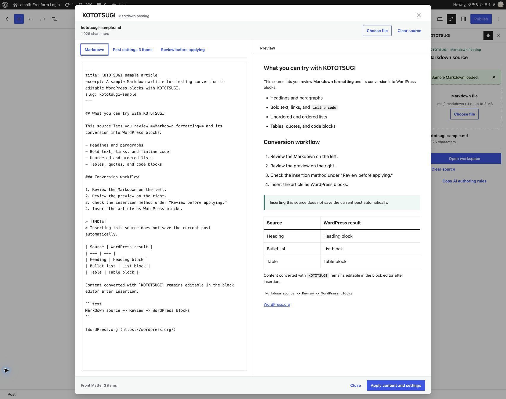

<div align="center">
  
  <h1>KOTOTSUGI</h1>
  <p><strong>Carry AI-friendly Markdown into editable WordPress articles.</strong></p>
  <p>
    <a href="https://upf.at-shift.net/en/kototsugi/">Official Website</a> ·
    <a href="https://github.com/at-shift/atshift-kototsugi/releases">Releases</a> ·
    <a href="https://upf.at-shift.net/kototsugi/">日本語</a>
  </p>
</div>

## Overview

KOTOTSUGI adds a focused Markdown posting workspace to the WordPress block editor. Paste a draft from ChatGPT, Claude, Gemini, or another writing tool, or load a local Markdown file. Review the source and article preview together, then carry the result into WordPress as standard blocks that remain fully editable.

Front Matter can bring the title, excerpt, slug, tags, categories, and featured image into the same review flow. Preflight checks identify unsupported syntax, heading problems, image URL issues, and title conflicts before anything is applied.

Quick Post provides a separate, passphrase-protected posting page for people who should not need to learn the WordPress admin screen. An administrator chooses the destination, author, category, display language, and draft or publish behavior in advance; the contributor only writes, reviews, and submits.

## The Name: KOTOTSUGI (言継ぎ)

KOTOTSUGI is a coined Japanese name written as **言継ぎ**. It combines *koto*, evoking words or an utterance, with *tsugi*, the act of continuing, inheriting, or passing something onward.

The name represents carrying words from an AI-generated Markdown draft into WordPress, where a person can continue editing, refining, and publishing them. KOTOTSUGI changes the format without treating generated text as a finished or unchangeable artifact.

## Screenshots

### Review the source and preview together



Compare the Markdown structure with the article that will be inserted into WordPress. Post settings, preflight results, insertion methods, and conversion options remain available in the same workspace.

## Features

- Paste Markdown or load `.md`, `.markdown`, and `.txt` files
- Try the full workflow with a bundled sample article
- Copy service-neutral AI authoring rules for ChatGPT, Claude, Gemini, and other writing tools
- Review the source and rendered article side by side
- Convert headings, paragraphs, emphasis, links, images, lists, tables, quotes, code blocks, horizontal rules, and GitHub-style callouts
- Review and apply Front Matter values for the title, excerpt, slug, tags, categories, and featured image
- Check unsupported syntax, image URLs, heading hierarchy, and title conflicts before applying content
- Add blocks at the cursor, replace the current post body, or create a separate draft
- Import supported remote images into the WordPress Media Library
- Keep the original external image URL when an import cannot be completed
- Generate standard WordPress blocks that remain editable after insertion and plugin deactivation
- Offer a standalone Quick Post page without exposing the WordPress admin screen
- Accept ordinary text and simple notation in Quick Post, with Markdown available when needed
- Attach up to five JPEG, PNG, GIF, or WebP images with editable alternative text
- Let administrators fix the Quick Post author, category, destination, display language, and submission status
- Protect Quick Post with a passphrase, throttled login attempts, revocable browser sessions, CSRF protection, capability checks, and duplicate-submission prevention
- Include bundled translations for 15 supported languages

## Requirements

- WordPress 6.4 or later
- PHP 7.4 or later
- The WordPress block editor for the Markdown posting workspace

Quick Post can be used without opening the WordPress admin screen after an administrator completes its initial configuration.

## Languages

English is provided by the plugin source. Bundled translations are included for Japanese, Spanish, German, French, Brazilian Portuguese, Italian, Russian, Dutch, Simplified Chinese, Polish, Turkish, Indonesian, Traditional Chinese (Taiwan), and Korean.

The Markdown workspace follows each WordPress user's profile language. Quick Post uses the display language selected by an administrator, independently from the site's language.

## Installation

1. Download the latest ZIP from [GitHub Releases](https://github.com/at-shift/atshift-kototsugi/releases).
2. In WordPress, open **Plugins > Add Plugin > Upload Plugin**.
3. Upload the ZIP and activate KOTOTSUGI.
4. Open a post, page, or supported custom post type in the block editor.
5. Select KOTOTSUGI from the editor's Options menu or its pinned pencil button.

## Getting Started

Open KOTOTSUGI in the block editor, then choose **Load sample Markdown** for a one-click trial or **Open workspace** to paste a draft. The desktop workspace places Markdown and its preview side by side; narrow screens provide tabs for the same views.

Review optional Front Matter values under **Post settings**. Open **Review before applying** to check warnings, choose an insertion method, and adjust conversion options. Adding at the cursor or replacing the current body never saves the current post automatically.

For AI-assisted writing, choose **Copy AI authoring rules** or use [`rules/KOTOTSUGI-RULES.md`](rules/KOTOTSUGI-RULES.md). The rules ask the writing tool to create portable Markdown and to write titles, labels, image alternative text, and other reader-facing text in the reader's requested language.

## Markdown Posting

KOTOTSUGI supports the Markdown structures commonly used in practical articles:

- ATX headings
- Paragraphs, bold, italic, inline code, and links
- Images with alternative text
- Ordered and unordered lists
- Simple GitHub Flavored Markdown tables
- Quotes and fenced code blocks
- Horizontal rules
- GitHub-style `NOTE`, `TIP`, `IMPORTANT`, `WARNING`, and `CAUTION` callouts
- YAML Front Matter post settings

The workspace offers three insertion methods:

1. **Add at cursor** inserts the converted blocks at the current editor position.
2. **Replace post content** replaces the current body after confirmation without saving the post.
3. **Create new draft** saves the imported article as a separate WordPress draft.

## Front Matter

KOTOTSUGI recognizes a focused YAML-compatible subset intended for AI-generated drafts:

```yaml
---
title: Article title
excerpt: Article summary
slug: article-slug
tags: [WordPress, Markdown]
categories: [Guides]
featured_image: https://example.com/image.jpg
featured_image_alt: Description of the image
---
```

Every supported value can be reviewed, edited, or disabled before it is applied. Unknown keys are listed for review and are never applied automatically. Front Matter does not change the post author, publication status, or publication date.

## Quick Post

Quick Post keeps the contributor flow deliberately narrow: enter a title and article text, attach images when needed, review the result, and submit.

Administrators configure it from **Settings > KOTOTSUGI**:

1. Choose the display language and publishing destination.
2. Choose the fixed post author and optional default category.
3. Decide whether submissions become drafts or are published immediately.
4. Set a passphrase of at least eight characters and enable Quick Post.
5. Share the displayed posting URL and passphrase with the contributor.

Ordinary text becomes paragraphs. Blank lines separate sections, `・` can create lists, and short standalone lines can become headings. Optional prefixes add more structure: `@` for a place, `!` for important information, `※` for a note, `¥` for a price, and `☎` for a phone number. Plain text and pasted Markdown are both accepted.

The source field works with the operating system's standard dictation. KOTOTSUGI does not request microphone access, record audio, or connect to a speech service.

## Review and Safety

KOTOTSUGI is designed around review before insertion or submission.

- The current editor post is never auto-saved by Markdown insertion or replacement
- Unsupported or ambiguous Markdown is reported before applying content
- Submitted Quick Post blocks are parsed against an allowlist and sanitized server-side
- Remote image imports require the WordPress `upload_files` capability
- Private-network URLs, SVG files, unsupported formats, and oversized files are rejected
- Quick Post validates the configured author's create, publish, and upload capabilities
- Login attempts are throttled and browser sessions can be revoked
- Submission tokens and duplicate-submission locks protect the posting flow

Remote images are limited to the lower of the site's upload limit or 10 MB. When an image cannot be imported, KOTOTSUGI retains its original external URL and continues inserting the article.

## Documentation

| Topic | English | 日本語 |
| --- | --- | --- |
| Product guide | [KOTOTSUGI](https://upf.at-shift.net/en/kototsugi/) | [KOTOTSUGI](https://upf.at-shift.net/kototsugi/) |
| Releases | [GitHub Releases](https://github.com/at-shift/atshift-kototsugi/releases) | [GitHub Releases](https://github.com/at-shift/atshift-kototsugi/releases) |
| AI authoring rules | [KOTOTSUGI Rules](rules/KOTOTSUGI-RULES.md) | [KOTOTSUGI Rules](rules/KOTOTSUGI-RULES.md) |
| Sample article | [English sample](examples/kototsugi-sample-en.md) | [日本語サンプル](examples/kototsugi-sample.md) |

## Related Projects

- [atshift User Profile Fields](https://wordpress.org/plugins/atshift-user-profile-fields/) creates practical, configurable WordPress user profile screens with frontend editing and account-management tools.
- [at-shift Fields](https://wordpress.org/plugins/atshift-fields-maintenance-for-custom-field-suite/) provides a maintained custom-field builder for posts, pages, and custom post types.
- [atshift Freeform Login](https://wordpress.org/plugins/atshift-freeform-login/) adds a customizable WordPress login experience with server-verified passkey registration and authentication.
- [atshift Feed Builder](https://wordpress.org/plugins/atshift-feed-builder/) creates purpose-specific RSS 2.0 and JSON Feed 1.1 feeds from structured WordPress content.

## Tests

Run the Markdown parser tests with Node.js:

```sh
node tests/editor-parser.test.js
```

For the WordPress integration tests, set `KOTOTSUGI_WP_ROOT` to a local WordPress installation:

```sh
KOTOTSUGI_WP_ROOT=/path/to/wordpress php tests/media-import.test.php
KOTOTSUGI_WP_ROOT=/path/to/wordpress php tests/quick-post.test.php
```

## Reporting Issues

Please use [GitHub Issues](https://github.com/at-shift/atshift-kototsugi/issues) and include reproduction steps together with your WordPress, PHP, and KOTOTSUGI versions.

## License

[GPL-2.0-or-later](LICENSE)
